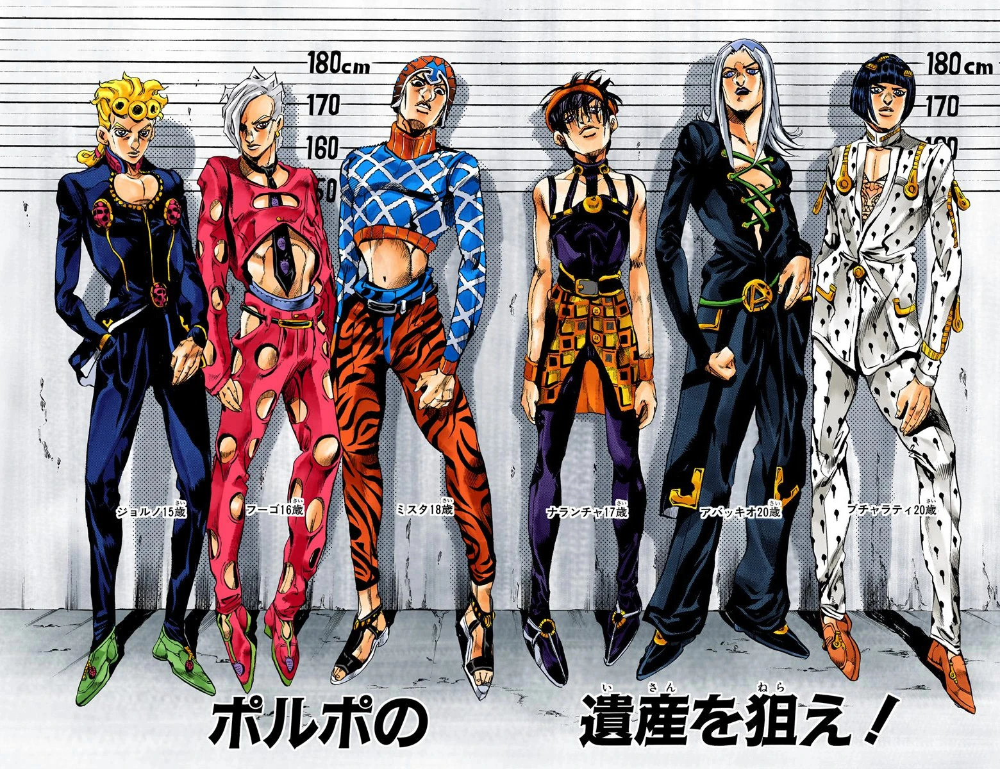

# Mafia Family Succession Prototype

This project is a prototype system to help an Italian mafia family track and manage the succession of the family boss.

The program reads members from a database, builds a binary succession tree, shows the current line of succession, and automatically assigns a new boss when required.

## Project Goals

1. Load member data from a database into a binary tree.
2. Display the current succession line (only living members).
3. Automatically assign a new boss when the current boss dies, goes to jail, or exceeds age constraints.
4. Allow updates to node data except for immutable identity fields.

## Input Data Format

The table must contain the following columns:

`id,name,last_name,gender,age,id_boss,is_dead,in_jail,was_boss,is_boss`

### Field Rules

- `gender`: only `H` or `M`.
- `was_boss`, `is_boss`, `is_dead`, `in_jail`: only `0` or `1`.
	- `1` means true.
	- `0` means false.
- `id`: unique member identifier.
- `id_boss`: parent/boss identifier used to place the member in the binary tree.

## Automatic Boss Assignment Rules

When the current boss dies or cannot continue as boss, assign a new boss using the following rules.

1. If the boss dies and has assigned successors, the new boss is the first living successor found in the boss subtree who is not in jail.
2. If the boss dies and has no successors, search in the subtree of the boss's sibling successor (the other successor of the boss's parent) and choose the first living member outside jail.
3. If that sibling successor is alive, outside jail, and has no successors, that sibling successor becomes the successor.
4. If the boss dies and neither direct successors nor an alternative successor from the previous boss exists, search the sibling subtree of the previous boss; if no subtree candidate exists and the sibling is alive, that sibling becomes boss.
5. If no successor is found in the subtree rooted at the boss's boss, move upward and find the closest ancestor with two successors outside jail; choose the first living, non-jailed successor.
6. If all free (non-jailed) bosses and successors are dead, apply the same search logic among living jailed members, starting from the closest level to the current boss, until a valid new boss is found.
7. If a boss is older than 70 or goes to jail, leadership is transferred to the first living, non-jailed successor in that boss subtree.

